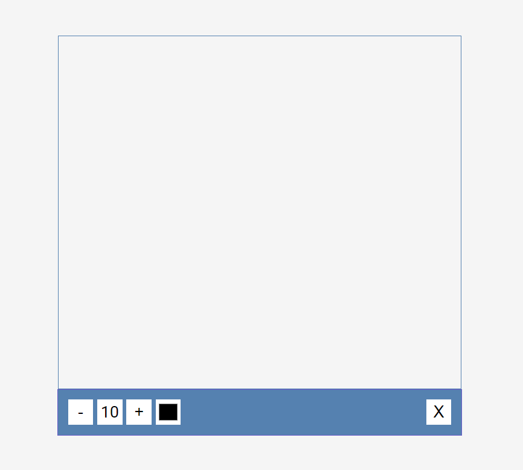
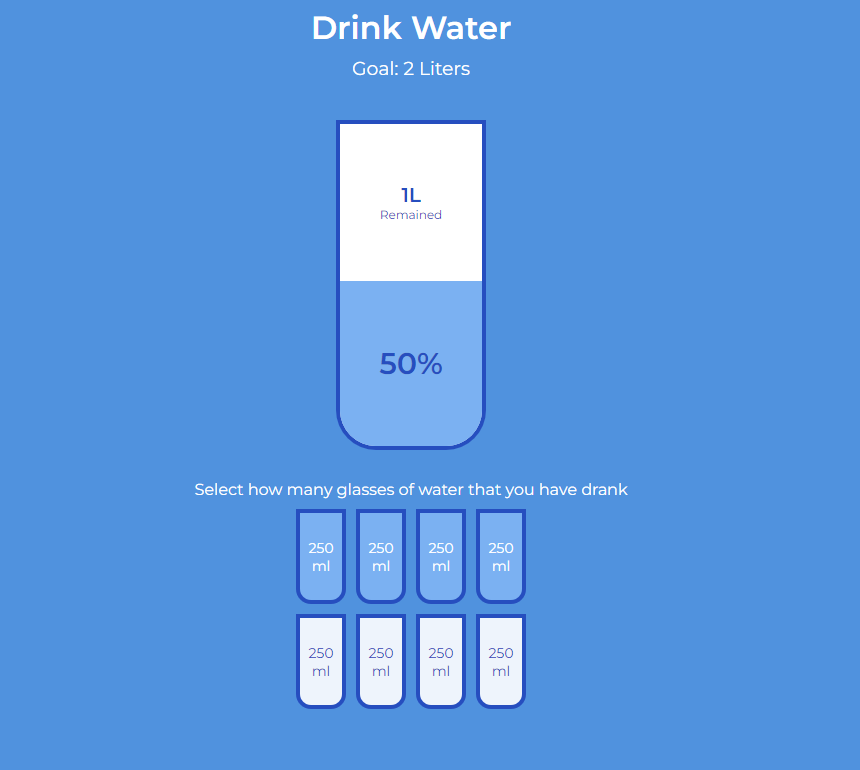
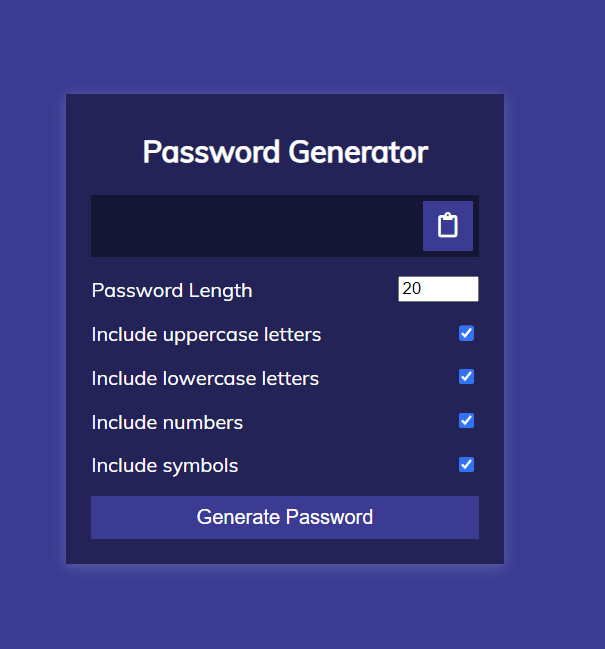
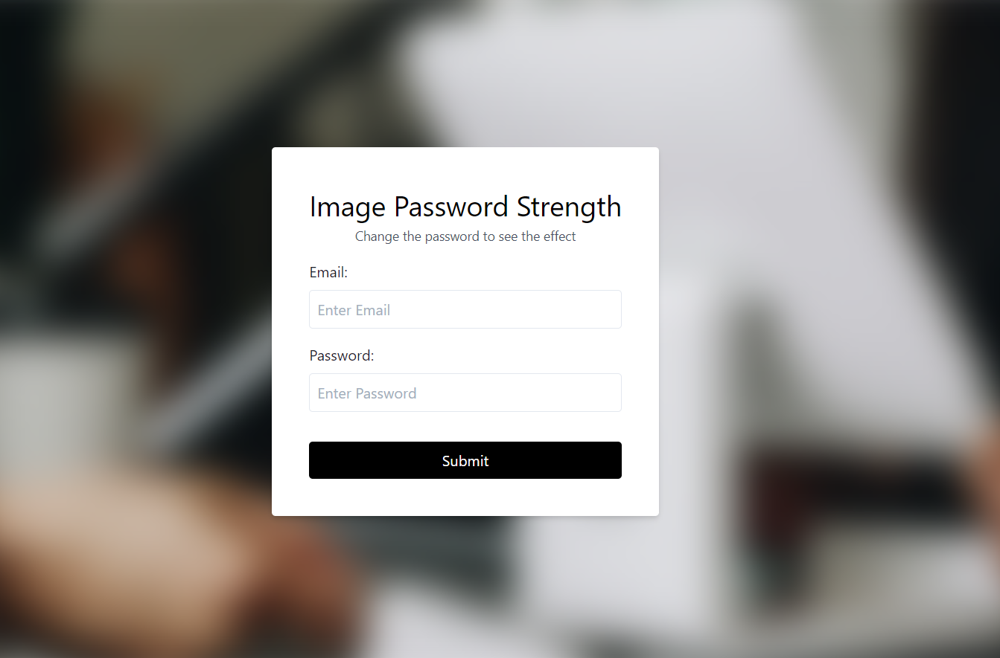
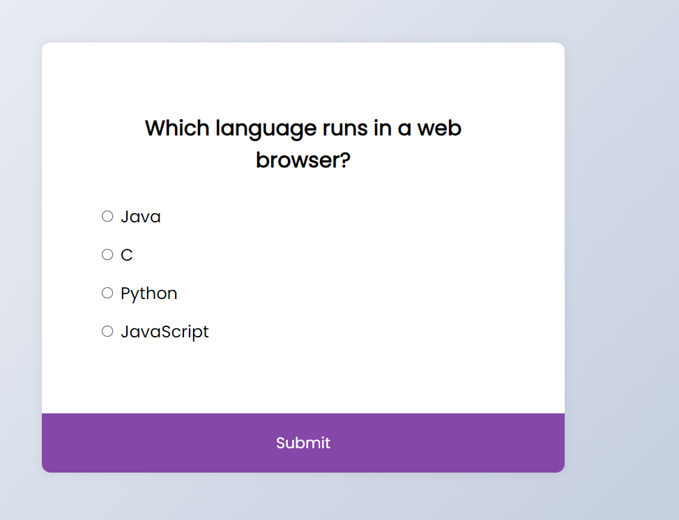
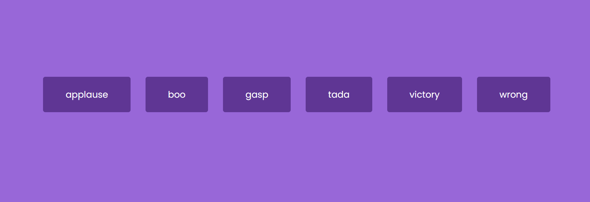
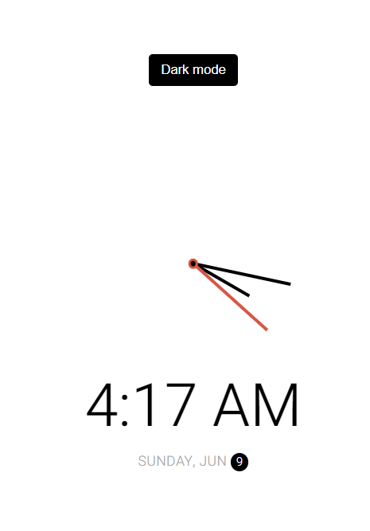
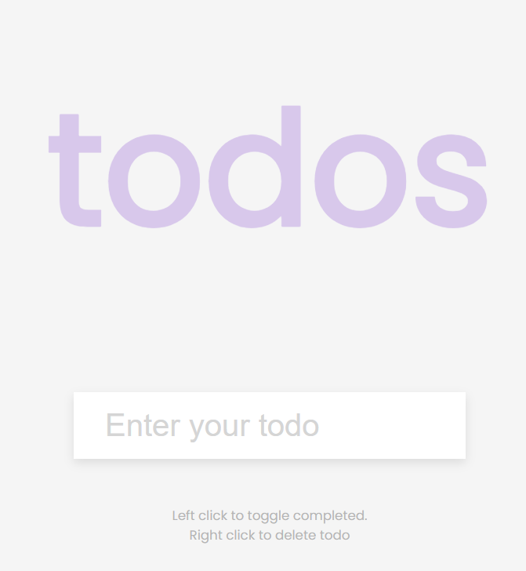

# Web Technology Mini Projects

This repository contains a collection of mini-projects developed to demonstrate various web technologies. Each project showcases different aspects of HTML, CSS, and JavaScript, offering a range of functionalities from simple UI components to interactive applications.

## Table of Contents

- [Description](#description)
- [Projects](#projects)
  - [Drawing App](#drawing-app)
  - [Drinking Water Tracker](#drinking-water-tracker)
  - [GitHub Pages](#github-pages)
  - [Password Generator](#password-generator)
  - [Password Strength Checker](#password-strength-checker)
  - [Quiz App](#quiz-app)
  - [Sound Board](#sound-board)
  - [Theme Clock](#theme-clock)
  - [To-Do List](#to-do-list)
- [Technologies Used](#technologies-used)
- [Installation](#installation)
- [License](#license)
- [Contact](#contact)

## Description

This repository contains nine mini-projects built using web technologies. These projects are designed to help understand and practice different aspects of web development, including UI design, interactivity, data manipulation, and more.

## Projects

### Drawing App

A simple drawing application that allows users to draw on a canvas using different colors and brush sizes.

#### Features

- Draw with different colors
- Adjust the brush size
- Clear the canvas
- Save the drawing as an image



### Drinking Water Tracker

A web app to help users track their daily water intake and ensure they stay hydrated.

#### Features

- Add glasses of water consumed
- Visual representation of daily goal
- Reset daily intake



### GitHub Pages

A project demonstrating how to create and host a personal or project website using GitHub Pages.

#### Features

- Create a simple website
- Deploy to GitHub Pages
- Custom domain setup (optional)


### Password Generator

A tool to generate strong, random passwords based on user-selected criteria.

#### Features

- Select password length
- Include/exclude uppercase, lowercase, numbers, and symbols
- Copy generated password to the clipboard



### Password Strength Checker

An application that evaluates the strength of a password based on various criteria and provides feedback to the user.

#### Features

- Real-time strength assessment
- Visual feedback on password strength
- Suggestions for stronger passwords



### Quiz App

An interactive quiz application that presents multiple-choice questions and provides feedback on the user's performance.

#### Features

- Multiple-choice questions
- Score tracking
- Immediate feedback on answers



### Sound Board

A fun application that plays different sounds when buttons are clicked, simulating a soundboard.

#### Features

- Play different sounds
- Visual feedback when a sound is played
- Stop all sounds button



### Theme Clock

A stylish clock application that allows users to switch between different themes.

#### Features

- Real-time clock display
- Multiple themes to choose from
- Smooth transitions between themes



### To-Do List

A classic to-do list application that helps users manage their tasks efficiently.

#### Features

- Add, edit, and delete tasks
- Mark tasks as completed
- Filter tasks by status



## Technologies Used

- HTML
- CSS
- JavaScript

## Installation

1. **Clone the repository:**
   ```sh
   git clone https://github.com/your-username/web-tech-mini-projects.git

## License
This project is licensed under the [MIT License](LICENSE.md) - see the LICENSE.md file for details.

## Contact
[LinkedIn ](https://www.linkedin.com/in/shubhangi23/)
